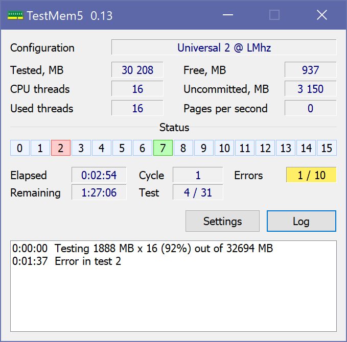

<i>I'll be back. - The Terminator</i>

## TestMem5 — PC RAM stress test

This is an official website of **TestMem5** program, modified by **CoolCmd**.

The original version [TestMem5 0.12 by Serj](http://testmem.tz.ru/testmem5.htm) has several annoying bugs and limitations, and is also very unfriendly. Unfortunately, Serj abandoned the development of the program. CoolCmd fixed most of the shortcomings. The fixed version of TestMem5 now lives on this site.

> [!NOTE]
> Some antiviruses, including those built into Windows, may claim that this program contains a virus. This is a false positive. Stupid heuristic antivirus analyzers do not like programs written in Assembly language.

## TestMem5 — программа для тестирования оперативной памяти ПК

Это официальный сайт программы **TestMem5**, которую дорабатывает **CoolCmd**.

Исходная версия [TestMem5 0.12 автора Serj](http://testmem.tz.ru/testmem5.htm) имеет несколько досадных ошибок и ограничений, а также очень неудобна в использовании. К сожалению, Serj забросил разработку программы. CoolCmd исправил большинство недостатков. Доработанная им версия теперь живет на этом сайте.

### Где можно взять свежую версию?

Список всех версий TestMem5 с описанием изменений находится [здесь и только здесь](https://github.com/CoolCmd/TestMem5/releases). Для самых нетерпеливых, вот [ссылка на архив с наисвежайшей последне-крайней версией](https://github.com/CoolCmd/TestMem5/releases/latest/download/TestMem5.7z).

Номер версии TestMem5 можно узнать, заглянув в Проводнике в свойства файлов `TM5.exe` и `TM5.dll`. Если там нет номера версии, то это устаревшая версия 0.12.

### Установка и запуск

1. Скачайте архив по указанному выше адресу.
2. Если у вас есть другие версии TestMem5, то удалите их. Архив содержит все необходимые файлы. Вы также можете удалить свои файлы конфигураций TestMem5 (файлы с расширением cfg), потому что в архиве есть и они.
3. Распакуйте содержимое архива в любую папку.
> [!NOTE]
> Некоторые антивирусы, включая встроенный в Windows, могут заявить, что в архиве есть вирус. На самом деле в архиве вирусов нет, просто тупые эвристические анализаторы антивирусов не любят программы, написанные на Ассемблере.
4. Создайте ярлык на файл `TM5.exe`.
5. Запустите TestMem5.
> [!IMPORTANT]
> Рекомендую запускать программу от имени Администратора.
6. Нажмите кнопку `Настройки` и прочтите справку. Тестирование памяти — не такая простая вещь, как вам кажется.

### Как связаться с автором

Обсуждение TestMem5 ведётся на [форуме Overclockers.ru](https://forums.overclockers.ru/viewtopic.php?f=47&t=366315) и на [сайте GitHub](https://github.com/CoolCmd/TestMem5/issues). Сообщайте об ошибках и предлагайте свои полезные идеи.

### Отличия от версии 0.12

* Исправлены ошибки:
	* Иногда тестирование досрочно прерывалось (первая ошибка), но программа делала вид, что оно продолжается (вторая ошибка).
	* Часто сообщение об окончании тестирования появлялось до его реального окончания. Разница могла доходить до пары минут.
	* Не работало защёлкивание памяти. Теперь защёлкивание работает и включено по умолчанию.
	* Выполнялись лишние тесты, если количество тестов в цикле равно 32-м. Поэтому во всех конфигурациях в цикле было не более 31-го теста. Теперь их количество можно увеличить до 32-х.
	* Если винда выделяла меньше памяти, чем было затребовано, программа радостно сообщала об успешном окончании тестирования, даже если было протестировано всего пара мегабайтов. Теперь при любой ошибке выделения памяти тестирование прерывается.
	* Иногда, с настройками `Использовать AWE = Никогда` и `Количество потоков = Авто`, количество потоков выбиралось больше необходимого, что могло снизить эффективность тестирования.
	* Часто в файл журнала не записывалась информация о сбое памяти. В окне журнала в информации о сбое памяти отсутствовало прошедшее время. Сообщения в журнале игнорировали настройку языка.
	* Иногда после запуска окно могло оказаться за пределами экрана, например после смены разрешения или закрытия свёрнутого окна.
	* Редко могло быть одновременно запущено два экземпляра программы. Ни один из них нормально не работал.
	* Редко неправильно отображалось состояние тестов.
	* Редко неправильно рассчитывался размер тестируемой памяти.
* Все пользовательские настройки перенесены из файла конфигурации в отдельный файл `TM5.ini`. Теперь, после выбора только что скаченного файла конфигурации, язык не изменится на английский, окно не уедет за пределы экрана (хомяки не знают, что делать в этом случае), не включится бесполезный отладочный режим, не уменьшится размер тестируемой памяти, и так далее. Также пользовательские настройки не меняются при переключении с одной конфигурации на другую.
* Добавлено окно с настройками. Теперь не нужно копаться в кишках файлов конфигурации, рискуя их поломать. После изменения настроек программа автоматически перезапускается.
* В окно с настройками добавлена подробная справка. Также у каждой настройки есть контекстная справка.
* В командной строке можно переопределить любую настройку. Читайте в справке как это сделать.
* Улучшено поведение при возникновении ошибки в работе программы (не сбой памяти). Раньше программа показывала кучу одинаковых окон с загадочным текстом, а тестирование могло продолжаться. Теперь тестирование сразу прерывается, показывается одно сообщение на человеческом языке, с вариантами исправления ошибки. Можно открыть настройки без перезапуска программы.
* Конфигурации:
	* В архиве с программой находятся популярные файлы конфигураций. Пользователям больше не нужно искать их в интернетах. Имена файлов изменены, а `Config Name` и `Config Author`в файлах не используются. Это сделано, чтобы исключить расхождение и облегчить пользователям выбор конфигурации.
	* Выбор файла конфигурации в настройках программы стал более удобным.
	* Файлы конфигурации должны находиться только в папке `bin`. Перенос или переименование папки с программой не помешает найти указанный в настройках файл.
	* Конфигурация по умолчанию `MT.cfg` заменена на `Universal 2 @ LMhz.cfg`, чтобы повысить качество тестирования.
	* Если во время запуска программы не найден файл конфигурации, то будет использован файл по умолчанию. Если нет и его, то тестирование не будет начато. Об этих действиях сообщается пользователю. Раньше по тихому создавался и использовался `MT.cfg`, что понижало качество тестирования.
	* Если файл конфигурации таковым не является, то его содержимое не перезаписывается. Раньше можно было потерять документ, если случайно указать его вместо файла конфигурации.
	* Программа сообщает о том, что она исправила ошибочные параметры в файле конфигурации. После каждого исправления в конец файла не добавляется пустая строка, как этот делалось раньше.
* На Рабочем столе не создаётся ярлык для запуска TestMem5. Раньше он создавался по тихому и когда мне это не нужно. Кроме того, в коде создания ярлыка есть ошибки, которые могут привести к падению программы.
* Во время запуска программа удаляет файл `Crash.log`.
* Файлы журнала и настроек всегда ищутся в папке с TM5.exe, независимо от текущей папки, указанной в ярлыке.
* Время тестирования указывается в минутах, а не в циклах, чтобы меньше зависеть от конфигурации тестов и железа. После истечения времени программа ждёт завершения текущего цикла.
* На 64-битной винде разрешено размещать окно тестирования в верхних двух гигабайтах адресного пространства. Максимальный размер окна увеличен с 1536 до 2040. Добавлена настройка для выбора адреса окна. Удалена зависимость от нескольких неиспользуемых DLL, что может помочь немного увеличить размера окна в 32-битной винде.
* Максимальное значение настройки `Оставить свободной память` увеличено с 1024 до 999999. Добавлено значение `Авто`, которое используется по умолчанию, чтобы уменьшить вытеснение из памяти данных Windows и других приложений.
* Раньше размер тестируемой памяти рассчитывался перед каждым циклом. Теперь расчёт производится только один раз, чтобы уменьшить вытеснение из памяти данных Windows и других приложений.
* Раньше сначала выделялось две трети тестируемой памяти, а потом полный размер. Теперь сразу выделяется полный размер.
* Программа не уменьшает размер тестируемой памяти если файл подкачки отключён.
* Можно задать количество ошибок, после которых прервётся тестирование. По умолчанию это произойдёт после первой же ошибки. Это ускорит тестирование и уменьшит вероятность падения винды и повреждения данных в памяти и на диске.
* После успешного окончания тестирования или прерывания его по ошибке программа мигает заголовком окна или кнопкой на панели задач, проигрывает системный звук и показывает всплывающее уведомление. Вид звука и значка уведомления выбирается в зависимости от успешности тестирования. Звук и уведомление можно отключить в настройках.
* Улучшения журнала:
	* В настройках можно ограничить размер файла журнала `Log.txt` или запретить его создание.
	* В файле текст хранится в кодировке UTF-8 вместо ANSI.
	* Пишутся предупреждения о недоступности AWE и ошибке при защёлкивании памяти.
	* Пишется сообщение о прерывании тестирования пользователем, виндой, другим приложением или из-за ошибки программы.
	* В начале каждой строки пишется прошедшее время.
	* Список журнала автоматически прокручивается.
	* Можно скрыть журнал, нажав на кнопку `Журнал`. По умолчанию журнал скрыт.
	* В отладочном режиме в журнал сыпется отладочный спам.
* На всякий случай вызывается `SetProcessInformation`, чтобы винда не снижала частоту процессора.
* Во время тестирования винда не уведёт компьютер в сон, а также не станет выполнять задачи, требующие бездействия компьютера.
* Во время запуска программы курсор мыши не меняется на “песочные часы”.
* Увеличение масштаба текста в настройках Windows не приводит к замыливанию текста в окне программы.
* Прошедшее время всегда отображается в виде ч:мм:сс (зависит от региональных настроек Windows).
* Для повышения точности показатели отображаются не в гигабайтах, а в мегабайтах. Для разбочивости добавлены разделители разрядов (зависят от региональных настроек Windows).
* Количество тестируемой памяти отображается как число в мегабайтах вместо формулы NN x NN. Теперь вам не нужно считать результат на калькуляторе. :) Количество тестируемой памяти одним потоком есть в журнале.
* Добавлены показатели: осталось времени, номер текущего теста в цикле, `Не выделено`, `Страниц в сек.`. Подробности в справке.
* Удалены показатели: название процессора, CPU ID, частота процессора, SSE, отладочные попугаи, `Подкачка`.
* Улучшено автоопределение русского языка.
* Исправлен текст английских сообщений.
* Исправлен значок программы.
* Если пользователь входит в группу Администраторы, то программу можно будет запустить только от имени Администратора.
* В ресурсы файлов `TM5.exe` и `MT0.dll` добавлена информация о версии программы.
* Для работы `TM5.exe` нужен файл `TM5.dll`.
* Для запуска программы нужна минимум Windows 7.
